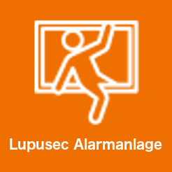

# ioBroker.lupusec
=================

Lupusec is a great alarm system from the company Lupus. This adapter connects the Lupusec alarm system with ioBroker. You can read informations
from the Lupusec sensors like door, windows, water and smoke sensors and you can turn on switches and arm/disarm the alarm system.

You can find more information here: [Lupus](https://www.lupus-electronics.de/en)

## Installation

1. Install the adapter

2. Configuration of the adapter

  Choose the IP-Address or hostname from the Lupusec alarm system.

3. ....

## Changelog

### 0.0.2 (17.05.2018)
* (Stübi) no Logic !!!!

### 0.0.1 (17.05.2018)
* (Stübi) initial release

## License
The MIT License (MIT)

Copyright (c) 2018 Thorsten Stueben <thorsten@stueben.de>

Permission is hereby granted, free of charge, to any person obtaining a copy
of this software and associated documentation files (the "Software"), to deal
in the Software without restriction, including without limitation the rights
to use, copy, modify, merge, publish, distribute, sublicense, and/or sell
copies of the Software, and to permit persons to whom the Software is
furnished to do so, subject to the following conditions:

The above copyright notice and this permission notice shall be included in
all copies or substantial portions of the Software.

THE SOFTWARE IS PROVIDED "AS IS", WITHOUT WARRANTY OF ANY KIND, EXPRESS OR
IMPLIED, INCLUDING BUT NOT LIMITED TO THE WARRANTIES OF MERCHANTABILITY,
FITNESS FOR A PARTICULAR PURPOSE AND NONINFRINGEMENT. IN NO EVENT SHALL THE
AUTHORS OR COPYRIGHT HOLDERS BE LIABLE FOR ANY CLAIM, DAMAGES OR OTHER
LIABILITY, WHETHER IN AN ACTION OF CONTRACT, TORT OR OTHERWISE, ARISING FROM,
OUT OF OR IN CONNECTION WITH THE SOFTWARE OR THE USE OR OTHER DEALINGS IN
THE SOFTWARE.
