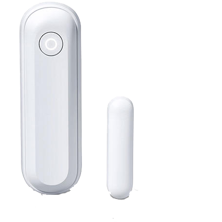

# Devices

## Door contact / window contact (Type 4)

| Status          	| Descriptinon 	| Read/Write 	|
|-----------------	|--------------	|------------	|
| alarm_status    	|            	| read       	|
| alarm_status_ex 	|              	| read       	|

## Water sensor (Type 5)
## Motion detector / 360 degree motion detector (Type 9)
## Smoke Detector / Heat Detector (Type 14)
## Status Indicator / Mini Indoor Siren (Type 22)
## Power Switch (Type 24)
## 1 channel relay with ZigBee repeater (Type 24)
## 2 channel relay with ZigBee repeater (Type 24)
## Keypad (Type 37)
## Power Switch Meter (Type 48)
## Room sensor V1 (Type 54)
## Dimmer (Type 66)
## Hue (Type 74)
## Roller shutter relay V1 (Type 76)
## Radiator thermostat (Type 79)
## Radiator thermostat V2 (Type 79)
## Light sensor (Type 78)
## CO sensor (Type 13)